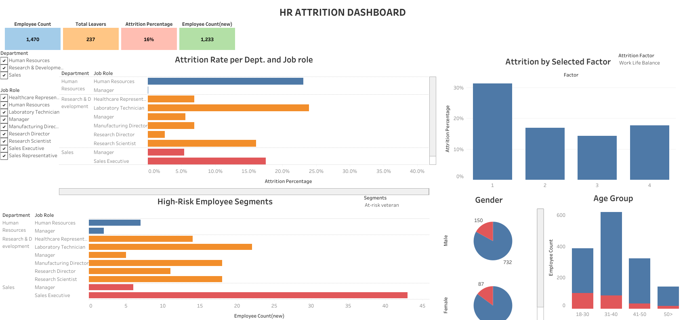

# HR Attrition Analysis

This project analyzes employee attrition using MySQL for data querying and Tableau for visualization. It uses the IBM HR Employee Attrition dataset to identify key factors behind employee turnover and segment high-risk employee groups.

## Live Dashboard
* [View Interactive Dashboard on Tableau Public](https://public.tableau.com/views/HR_attritiondashboard/HRATTRITIONDASHBOARD?:language=en-US&:sid=&:redirect=auth&:display_count=n&:origin=viz_share_link)

---

## Key Findings

* **Total Attrition:** 16.12% (237 out of 1,470 total employees).
* **Overtime:** Employees working overtime have an attrition rate of 30.53%, compared to 10.44% for non-overtime staff.
* **Underpaid Staff:** Employees earning below 85% of their role and level peer average show higher turnover rates.
* **Combined Risk:** High overtime, low work-life balance, and long commutes increase the overall probability of resignation.

---

## Project Structure

* **`data/`**: Raw CSV dataset.
* **`sql/01_data_cleaning.sql`**: SQL queries for column fixes, staging table setup, and basic metrics.
* **`sql/02_attrition_risk_analysis.sql`**: Advanced SQL queries including window functions for peer salary benchmarks, temporary tables, risk scoring, and high-risk cohort isolation.
* **`tableau/`**: Packaged Tableau workbook file (.twbx).
* **`assets/`**: Screenshot preview of the dashboard.

---

## How to Run

1. Load `data/HR_Employee_Attrition.csv` into a MySQL database.
2. Run `sql/01_data_cleaning.sql` to clean the data and create the staging table.
3. Run `sql/02_attrition_risk_analysis.sql` to execute the risk calculations and cohort queries.
4. Open `tableau/HR_Attrition_Dashboard.twbx` in Tableau to view the interactive dashboard.
